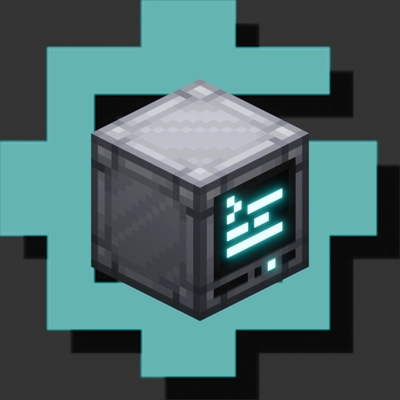

<h1 align = "center"> ComputerCraft: Greg Flavored

 

</h1>

**Warning! This resource pack doesn't feature turtles** Turtles are removed in most GregTech packs due to them completely breaking all progression, and changing their models has proven to be too big of a headache for me so they're not included :<zero-width space>(. There is an optional [KubeJS](https://github.com/KubeJS-Mods/KubeJS)  script in the repo that removes turtles from jei and crafting [here](https://github.com/BirbIrl/ComputerCraft-Greg-Flavored/tree/main/KubeJS)

If you're on **Fabric**, [Iris](https://github.com/IrisShaders/Iris) is required with a shader enabled. Why? I have no idea. it just wont work, the render types get all messed up for certain blocks.

**ComputerCraft: Greg Flavored** is a family of easily customizable resource packs for [CC: Tweaked](https://github.com/cc-tweaked/CC-Tweaked) (required) that tries to fit the style of [GTCEu: Modern](https://github.com/GregTechCEu/GregTech-Modern) and [GregTech Refreshed](https://github.com/ULSTICK/GregTechRefreshed) (not required) with extra bloom support using [Shimmer](https://github.com/Low-Drag-MC/Shimmer) (optional). As of 1.1 it also supports [Advanced Peripherals](https://github.com/IntelligenceModding/AdvancedPeripherals)

 

CC:GF is ***Also*** as a set of [KubeJS](https://github.com/KubeJS-Mods/KubeJS) scripts used to integrate Computers into GregTech that can be found [here](https://github.com/BirbIrl/ComputerCraft-Greg-Flavored/tree/main/KubeJS), if you're playing a custom pack/a pack that doesn't manually add in computers, having the two scripts can help with balance and integrity. Just make sure your pack doens't already have recipie overrides for CC items :)

Thanks to Dadamalda, as of 1.1 the mod now has [Advanced Peripherals](https://github.com/IntelligenceModding/AdvancedPeripherals) support! The KubeJS scripts adds new recipies and removes a couple unused items. If you're a modpack maker and want to include the script, remember to look through it!

This Repository and certain releases contain original/modified textures and models from:
- [GregTech Refreshed](https://github.com/ULSTICK/GregTechRefreshed)
- [GTCEu: Modern](https://github.com/GregTechCEu/GregTech-Modern)
- [GregTech Programmer Art](https://github.com/marisathewitch/Gregtech-1.19-Programmer-art)
- [CC: Tweaked](https://github.com/cc-tweaked/CC-Tweaked)

